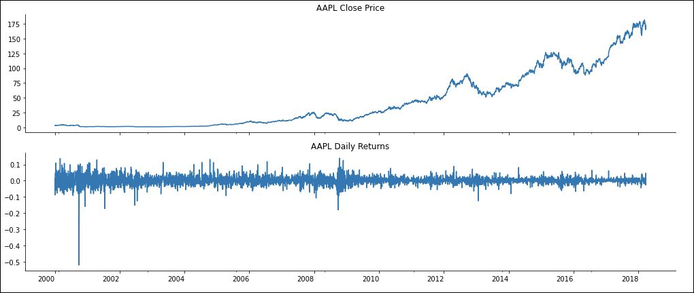
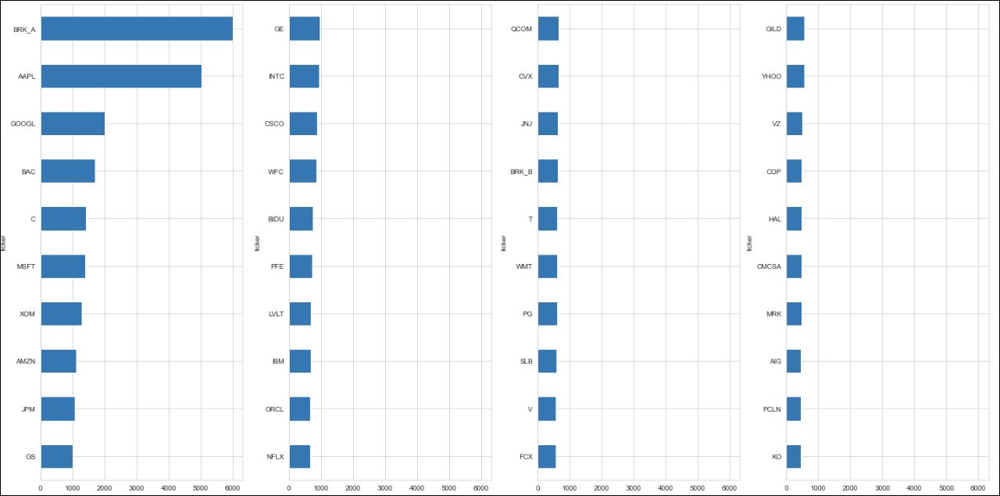
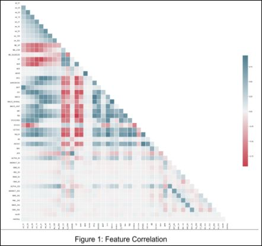
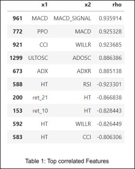
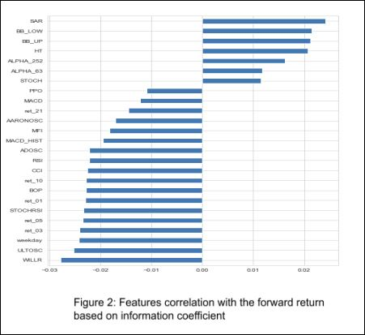
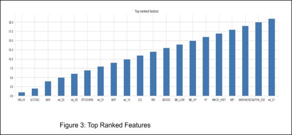
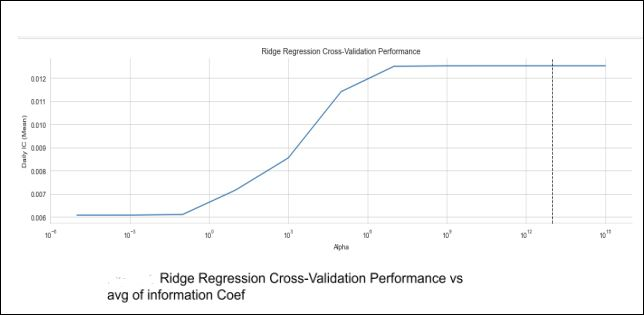

# US Stock Trading Prediction Model
From Majid Feiz, ML model for Stock prediction\
**Project Status: Completed**
 
<a href="https://github.com/majfeizatgmaildotcom/Stock_Pred/blob/fea91ec6e898279e076d3201eddbc526dcfb90e0/1-PreProcess.pdf"> 1-PreProcess Jupyter Notebook Viewer</a>\
<a href="https://github.com/majfeizatgmaildotcom/Stock_Pred/blob/fea91ec6e898279e076d3201eddbc526dcfb90e0/2-Feature_Calculation.pdf"> 2-Feature_Calculation Jupyter Notebook Viewer</a>\
<a href="https://github.com/majfeizatgmaildotcom/Stock_Pred/blob/fea91ec6e898279e076d3201eddbc526dcfb90e0/3-Feature_Selection.pdf"> 3-Feature_Selection Jupyter Notebook Viewer</a>\
<a href="https://github.com/majfeizatgmaildotcom/Stock_Pred/blob/fea91ec6e898279e076d3201eddbc526dcfb90e0/4-LinearModel_Gen.pdf"> 4-LinearModel_Gen.pdf Jupyter Notebook Viewer</a>

## Project Objective
This project aims to create a ML model to predict the daily stock return for the US stocks
trading. In this project, a subset of the Quandl Wiki data used to create a range of features that 
capture information about the future returns. The quality of these features has been evaluated. 
Features that have correlated with each other’s eliminated from the feature selections, and 
those that have highly correlated with the daily return are used as inputs to the machine learning 
models. Linear Regression with Ridge and Lasso regularization strategy selected to train the 
model and relative performance evaluated over the 16 fold cross-validation.
There are four main steps in this project:
1) Pre Processing the data
2) Features Calculations
3) Feature Selections
4) Building Linear Regression based on Ridge and Lasso

## 1) Dataset and Preprocessing
The data is downloaded from the NASDAQ Website and selected all US stock data after the 
year 2000.
The adjusted open, high, low, and close prices and the volume collected for all stocks for the 
2006–2016 time period.
There are 11,343,366 data points (row).
2014–2016 data is used as an “out-of-sample” period to test the performance of a strategy 
based on linear regression. The dollar volume is computed as the product of closing price and 
trading volume and then selected 500 stocks with at least eight years of data and the highest 
average daily trading volume in dollar terms.
I computed daily returns and kept only inliers with values between -100% and +100% as a basic 
check against data error.

Here I visualized the 40 most-traded stocks for the period of the 8 years study trade:

## 2) Feacture Engineering - Calculating the Financial Features:
The features calculated based on the financial features. I have utilized the Alpha Factory Library
to compute a broad range of features using pandas and TA-Lib.
The historical returns for various time ranges, such as 1, 3, 5, 10, and 21 trading days, as well
as longer periods like 2, 3, 6, and 12 months are computed.
I used TA-Lib’s Bollinger Band indicator to create features that predicted mean-reversion. And
calculated the indicators from TA-Lib’s momentum indicators family, as follows:\
-Average Directional Movement Index (ADX)\
-Moving Average Convergence Divergence (MACD)\
-Relative Strength Index (RSI)\
-Balance of Power (BOP)\
-Money Flow Index (MFI)\
-On Balance Volume (OBV)\
-Chaikin A/D Oscillator (ADOSC)\
-Volatility metrics such as the Normalized Average True Range (NATR).\
I have evaluated these new features computed above and down-selected the most promising
ones for building a machine learning model. The rank
correlation among
the features has
been evaluated.

Figure 1 shows the
correlation of all
features.

Table 1
shows the top
correlated features
that are removed
from the final feature
selections.

## 3) Feacture Engineering - Selecting the best Financial Features
The next step of the feature engineering process is to select the top features that are highly
correlated with the forward return. The predictive content of financial features for the 1-day
forward returns has been evaluated using the information coefficient (the Spearman rank
correlation) Figure 2, and rank them from highest to lowest Figure 3.

 

## 4) Building Linear Regression based on Ridge and Lasso
A specific time series splitter function, ‘MultipleTimeSeriesCV’, based on the scikit-learn KFold
interface, has been used to prevent inadvertently introducing look-ahead bias or leakage. I used
linear regression, including the regularized Lasso and Ridge versions. Then created 16 folds for
performing cross-validation to optimize the model's hyperparameters.\
To establish a baseline, I trained a LinearRegression using five years of training data to predict
rolling windows of three months of returns for the years 2013-2016. The results are evaluated
by computing the information coefficient (IC) as the Spearman rank correlation between the
predictions and the actual returns, averaged per day.\
Next, I used regularized regression models that include a penalty term to shrink the coefficients
and limit the risk of overfitting. Cross-validate a range of alpha penalty values for Lasso and
Ridge using the same training and validation periods as for the linear regression baseline and
compare their performance.\
The cross-validation loop iterates over the train and test indices provided by MultipleTimeSeriesCV,
selects features and outcomes, trains the model, and predicts the test features' returns.
The train and test scores for linear regression indicated a poor relative performance. The calculated average of the information coefficient of
y_pred vs y_true is about 0.59%, which is fairly low too.

In the next step I used a regularized ridge and Lasso model, and used it to evaluate whether parameter
constraints improve on the linear regression's predictive performance.
The Ridge and Lasso models used to select the hyperparameter alpha that determines the
weight of the penalty term in the model's objective function.

Figure below shows the Ridge Regression avg information coefficient of y_pred vs y_true as a function of alpha that
is up to 1.25% and shows better performance relative to the Linear Regression without any
regularization. The Ridge Regression also out performed the Lasso Regression with the IC is about 0.7%.

